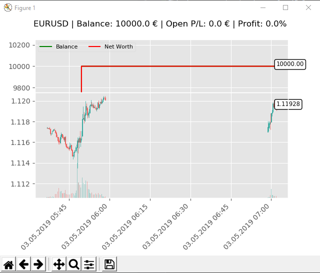

# OpenAIGymRLTrader

This is an example of using an OpenAI Gym environment for training a reinforcement learning trading agent.

The concept and code are inspired by the work of Adam King, described in his article published on 
Medium.com [https://towardsdatascience.com/@notadamking](https://towardsdatascience.com/@notadamking).

This is currently work in progress and only intended to be used purely for educational purposes.
The software is provided as is with now warranties.

#### DO NOT TRY TO USE THIS FOR ANY KIND OF LIVE TRADING!

If you want to test the software start with [example notebook for creating training data](https://github.com/chricke/OpenAIGymRLTrader/blob/master/Example_create_training_dataset.ipynb).

After you have prepared the data as described you should be able to start the training with

`python forex_train.py`

After the first checkpoint files have been written to the `checkpoints` directory (ending with .pkl) you can start a test
of the current model with

`python forex_test.py`

which will give you a nice visual feedback of the current state of the agent.

